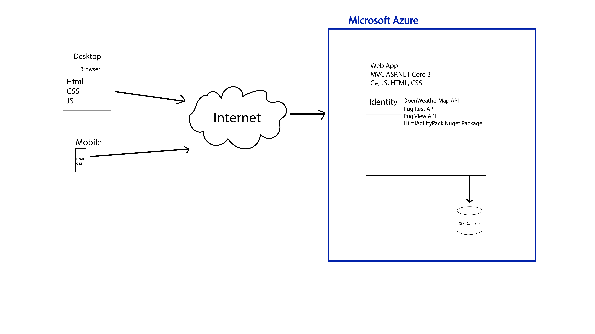

# Spill Tracker

## Vision Statement - 
For environmental workers who need to report spills or look up information about chemicals if a report is needed. The Chemical Spill Tracker is an information system that will allow people to calculate whether or not the spill at the company or location will need to be reported to the proper authorities. This site will allow users to save and store the chemical information at their company or site for future use. They will also be able to access the weather information where the spill occurred to help with the calculation. After the spill has been calculated it will inform the user if they need to make a call or if the spill is still within the federal amount that is okay to not report. If a spill needs to be reported, then the site will provide the user with the proper information on how to report it and who to notify. Unlike the current spill reporting method, our product will allow users to enter all needed information, get the calculation automatically and show if it is reportable all in one location without having to look up chemicals, do the calculation manually and then search for the proper authorities to report to. 

## Diagrams -

## Needs and Features (Needs first) - 

- User login
    - Store company or location
    - Store chemicals that are frequently used
    - Store past spills

- Spill form
    - Allows users to input:
    - chemical info
    - Location of spill
    - Weather or external factors
    - See example report form

- Spill Calculation
    - Calculates all variables
    - Informs user if amount is reportable

- Report information
    - How to report
    - Who to contact/notify

- Scrubbing of chemical information
    - Use HTMLAgilityPack to get info from website
    - Populating chemical database

- Federal / State Requirements
    - Specific reporting info for each state/nationwide
    - Contact information for each state on who to report to

- Have weather information available
    - Use Open Weather Maps Api for data

- Have the ability for user to export data entered
    - Export data through XML or PDF format

- Admin feature for a company to have other users tie in to their specific company and see/access their information
    - one user to manager other users for a facility or facilities

## Example of information for a spill report -

- Who answered the call for a spill (at the facility)
- Time the call took place
- Who called in a spill (at the facility)
- Spill date time
- Facility spill occurred at
- Is the spill ongoing (y/n)
    - If y, requires report ran again later after spill finished to more accurately determine quantity spilled
- Spill contained on site (y/n)
- Which chemical spilled (from list of chemicals at facility)
- Chemical state [solid liquid gas]
- Is the liquid pressurized (y/n)
- Spilled on gravel/soil (y/n)
- Spilled on asphalt/concrete (y/n)
    - If y, is spill in a berm y/n -> if yes, get berm info (size, depth, etc)
- Volume spilled --> if unknown create a series of questions to ask
- Concentration of chemical
- Spill forming a puddle (y/n)
- Can spill reach a water system (y/n)
- If y, what water system (creek, city water treatment, pond etc)
- Duration of release (hours/minutes)
- Time before cleanup started (hours/minutes)
- Temperature of stored chemical (usually ambient but can vary)
- Estimated area of spill in feet (ex 25 ft x 25 ft)  

After determining if a spill is reportable, also have the user get case numbers from the agencies called (if applicable)  

## Chemical data needed - 

- Chemical name
- CAS No.
- Reportable quantity (lbs)
- Density (#)
- Density units (g/mol)
- Molecular weight (#)
- Molecular weight units 
- Vapor pressure (#)
- Vapor pressure units (mmHg)
- Water soluble (y/n)         might not need or might not be yes/no question
- Water reactive (y/n)        might not need or might not be yes/no question
- Flammable (y/n)             might not need or might not be yes/no question
- Corrosive (y/n)             might not need or might not be yes/no questions
- CERCLA chemical (y/n) → require nation response notification as well as state/local
- EPCRA chemical (y/n) → these chemicals are extremely hazardous substances, needed for reporting requirements

## What must be included in the emergency release notification? 

[From EPCRA Section 304 - Reporting Requirements:](https://www.epa.gov/epcra/epcra-section-304)
- The chemical name
- An indication of whether the substance is extremely hazardous
- An estimate of the quantity released into the environment
- The time and duration of the release
- Whether the release occurred into air, water, and/or land
- Any known or anticipated acute or chronic health risks associated with the emergency, and where necessary, advice regarding medical attention for exposed individuals
- Proper precautions, such as evacuation or sheltering in place
- Name and telephone number of contact person         

## What chemicals are regulated?

[From EPCRA Section 304 - Reporting Requirements:](https://www.epa.gov/epcra/epcra-section-304)
- [EPCRA Extremely Hazardous Substances](https://www.ecfr.gov/cgi-bin/text-idx?SID=5bda0c1c4736b83aaf402bed85944e07&mc=true&node=pt40.30.355&rgn=div5#ap40.30.355_161.a)
- [CERCLA Hazardous Substances](https://www.ecfr.gov/cgi-bin/text-idx?node=pt40.30.302&rgn=div5#se40.30.302_14)  
These are the sites that we will scrape when building the Chemical Data

## Which agencies need to be notified of a spill?

[From EPCRA Section 304 - Reporting Requirements:](https://www.epa.gov/epcra/epcra-section-304)  
"If a release of an Extremely Hazardous Substance (EHS) at or above its applicable reportable quantity, the facility must notify the State Emergency Response Commission (SERC) and Local Emergency Planning Committee (LEPC) for any area(s) likely to be affected by the release. If an accidental release of a hazardous substance listed under the Comprehensive Environmental Response, Compensation and Liability Act (CERCLA), the facility must notify the National Response Center (NRC), as well as the SERC and LEPC."  

EPA has a contact list for each State's initial point of contact for reporting spills, [availalbe here](https://www.epa.gov/epcra/state-contact-information-epcra-section-304-emergency-release-notification)  

## Workflow for building chemical data
1. Scrape the html tables w/ HTMLAgilityPack to get chemical name, cas no, reportable quantity
2. For each chemical:
    1. Call the pubchem pug rest api with the cas no to retrieve the id of the chemical in pubchem’s system  
    Ex: https://pubchem.ncbi.nlm.nih.gov/rest/pug/compound/name/107-02-8/property/MolecularWeight/json -> returns json caintaining cid 7847  
    2. Call the pubview pug view to retrieve the rest of the chemical data  
    Ex: https://pubchem.ncbi.nlm.nih.gov/rest/pug_view/data/compound/7847/JSON -> returns json containing chemical data ([this is the view for that particular chemical](https://pubchem.ncbi.nlm.nih.gov/compound/7847))
3. Save the chemical to the database

## example OpenWeatherMaps API Call

Current weather data:  
https://api.openweathermap.org/data/2.5/onecall?lat={latitude}&lon={longitude}&exclude={part}&appid={API key}

Historic weather data:  
https://api.openweathermap.org/data/2.5/onecall/timemachine?lat={latitude}&lon={longitude}&dt={date/time in unix time}&units=imperial&appid={API key}
