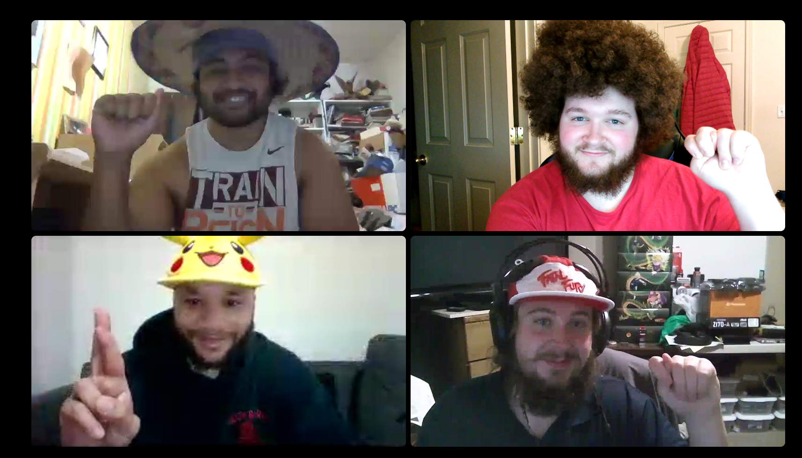

## Class Project Retrospective

1. Conduct a Safety Check if you can meet in person; what were the results? If you're holding it remotely, choose a different activity method from Fun Retrospectives.
> We chose to do a fun photo  
>> 

2. What did you learn from the Sprint?  
>Make users stories and tasks more descriptive and concise.     
>Breaking down our user stories when needed and constructing epics and tasks more desriptively.   
>Everyone check eachothers work before implementation to keep everyone on the same track  
>Pacing ourselves a little better to avoid burn out or last minute cramming.  

3. What isn't going well?  
>Getting back in the groove as far as remembering how to code   
>Time management  

4. What can the team do better during the next Sprint? You must make a specific Action Plan.
>Start our project early  
>Deploy to azure day before sprint review meeting  
>Create time frame to code with eachother if needed.   
>Continue to work and stay ahead

5. Are there any items that need to be brought up with someone outside the team? (i.e. in this case the instructor)
>Nothing comes to our attention at this time.  

